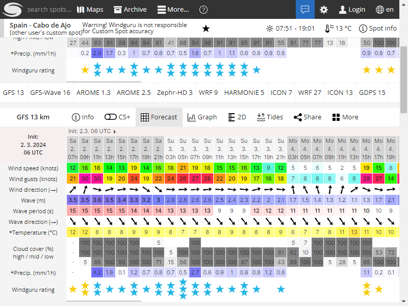

# Proyecto de Obtención de Datos Meteorológicos
Este proyecto tiene como objetivo recopilar datos meteorológicos de dos fuentes: [Windguru](https://www.windguru.cz/) y la Agencia Estatal de Meteorología [AEMET](https://www.aemet.es/). Además, realiza capturas de pantalla de la web Windguru.

# Ejecución
Ejecución completa:
```bash
python Main.py <ruta_guardado> <indicador windwuru> <identificador playa aemet> 
```

Ejecuciones parciales:

```bash
python TemperaturaLogger.py <identificador playa aemet> <ruta_guardado>
```


```bash
python TomarCapturaWindWuru.py <indicador windwuru> <ruta_guardado>
```


```bash
python WindWuLogger.py <indicador windwuru> <ruta_guardado>
```


# Datos Obtenidos
Ejemplo de JSON obtenido de Windguru:

 ```json
[
  {
    "\"17. 13h\"": {
      "viento": "11",
      "rafagas": "19",
      "olas_altura": "0.6",
      "periodo_olas": "4",
      "temperatura_tierra": "18"
    },
    "\"17. 15h\"": {
      "viento": "14",
      "rafagas": "29",
      "olas_altura": "0.8",
      "periodo_olas": "3",
      "temperatura_tierra": "18"
    }
  }
]
 ```


Ejemplo de JSON obtenido de AEMET:

 ```json
[
  {
    "fecha": "20240119",
    "t_agua": "13",
    "estado_cielo": {
      "f1": "120",
      "descripcion1": "muy nuboso",
      "f2": "100",
      "descripcion2": "despejado"
    }
  },
  {
    "fecha": "20240120",
    "t_agua": "13",
    "estado_cielo": {
      "f1": "100",
      "descripcion1": "despejado",
      "f2": "100",
      "descripcion2": "despejado"
    }
  }
]
 ```

Ejemplo de captura de pantalla


