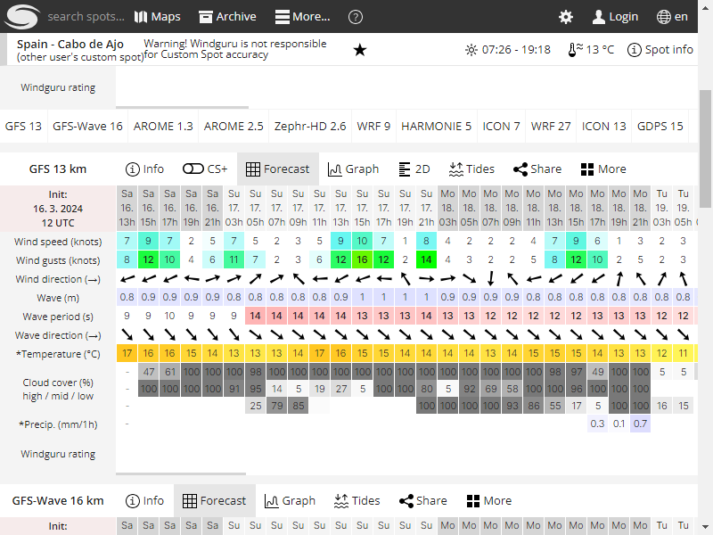

# Proyecto de Obtención de Datos Meteorológicos
Este proyecto tiene como objetivo recopilar datos meteorológicos de dos fuentes: [Windguru](https://www.windguru.cz/) y la Agencia Estatal de Meteorología [AEMET](https://www.aemet.es/). Además, realiza capturas de pantalla de la web Windguru.

# Ejecución

Ejecucion previa dentro del directorio donde se encuentra el archivo:
```bash
pip install .
```

Ejecución completa:
```bash
python .\Main.py <indicador windwuru> <identificador playa aemet>
```
```bash
python .\Main.py 487006 play_v2_3900602
```

Ejecuciones parciales:

```bash
python TemperaturaLogger.py <identificador playa aemet>
```


```bash
python TomarCapturaWindWuru.py <indicador windwuru>
```


```bash
python WindWuLogger.py <indicador windwuru>
```


# Datos Obtenidos
Ejemplo de JSON obtenido de Windguru:

 ```json
[
  "\"16. 19h\"": {
        "id_playa": "487006",
        "fecha": "16. 19h",
        "viento": "3",
        "rafagas": "4",
        "olas_altura": "0.9",
        "periodo_olas": "9",
        "temperatura_tierra": "16"
    },
    "\"16. 21h\"": {
        "id_playa": "487006",
        "fecha": "16. 21h",
        "viento": "4",
        "rafagas": "5",
        "olas_altura": "0.9",
        "periodo_olas": "9",
        "temperatura_tierra": "15"
    }
]
 ```


Ejemplo de JSON obtenido de AEMET:

 ```json
[
  {
    "id_playa": "play_v2_3900602",
    "fecha": "20240316",
    "t_agua": "13",
    "estado_cielo": {
      "f1": "120",
      "descripcion1": "muy nuboso",
      "f2": "120",
      "descripcion2": "muy nuboso"
    }
  },
  {
    "id_playa": "play_v2_3900602",
    "fecha": "20240317",
    "t_agua": "13",
    "estado_cielo": {
      "f1": "120",
      "descripcion1": "muy nuboso",
      "f2": "120",
      "descripcion2": "muy nuboso"
    }
  }
]
 ```

Ejemplo de captura de pantalla


