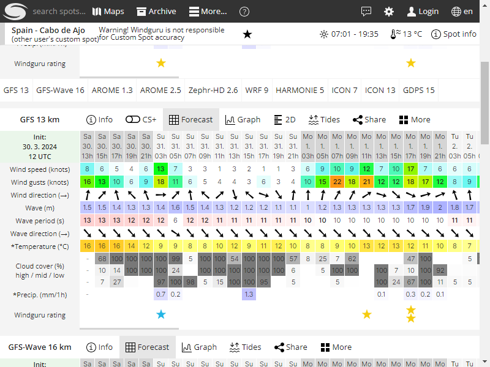

# Proyecto de Obtención de Datos Meteorológicos
Este proyecto tiene como objetivo recopilar datos meteorológicos de dos fuentes: [Windguru](https://www.windguru.cz/) y la Agencia Estatal de Meteorología [AEMET](https://www.aemet.es/). Además, realiza capturas de pantalla de la web Windguru.


# La versión de V2.1.0
En esta versión se implementa el guardado en la base de datos directamente en cada scrypt, ademas se añade la obtencion de datos iniciales

# Archivos configuración

```
requirements.txt
```

Se encuentra dentro de la carpeta init
Contiene las dependencias necesarias para poder ejecutar el scrypt


# init.py

Se encuentra dentro de la carpeta init
Contiene un código de python el cual al ser ejecutado obtiene los nombres de las dependencias y los instala

Ejecución:
```
PS C:\Users\alvar\Documents\GitHub\WebWeatherScraper\init> python .\init.py
```


# Proyecto de Obtención de Datos Meteorológicos


Este proyecto tiene como objetivo recopilar datos meteorológicos de dos fuentes: Windguruy la Agencia Estatal de Meteorología AEMET. Además, realiza capturas de pantalla de la web Windguru.

# Ejecución completa:

- Ejecución inicial
```python
python .\Main.py <indicador windwuru> <identificador playa aemet> <lugar de geolocalizacion>
```

```python
python .\Main.py 487006 play_v2_3900602 Ajo,Cantabria
```
- Guardar los datos
```python
python .\GuardarDatos.py 487006 C/....
```

```python
python .\GuardarDatos.py <indicador windwuru> <ruta donde se encuentran data_buceo>
```
Nota: el segundo no es necesario si se dejo por defecto

- Ejecución inicial (opción obtener datos de la configuración solo version v2.1.0)
```python
python .\Main.py 
```


# Ejecuciones parciales:

```python
python TemperaturaLogger.py <identificador playa aemet> <ruta donde se encuentran data_buceo>
Nota: el segundo no es necesario si se dejo por defecto
```

```python
python TomarCapturaWindWuru.py <indicador windwuru>  <ruta donde se encuentran data_buceo>
Nota: el segundo no es necesario si se dejo por defecto
```

```python
python WindWuLogger.py <indicador windwuru>  <ruta donde se encuentran data_buceo>
Nota: el segundo no es necesario si se dejo por defecto
```

```python
python ObtenerDireccionViento.py <lugar de geolocalizacion>  <ruta donde se encuentran data_buceo>
Nota: el segundo no es necesario si se dejo por defecto
```


# Datos Obtenidos
Ejemplo de JSON obtenido de Windguru:

 ```json
[
  "\"16. 19h\"": {
        "id_playa": "487006",
        "fecha": "16. 19h",
        "viento": "3",
        "rafagas": "4",
        "olas_altura": "0.9",
        "periodo_olas": "9",
        "temperatura_tierra": "16"
    },
    "\"16. 21h\"": {
        "id_playa": "487006",
        "fecha": "16. 21h",
        "viento": "4",
        "rafagas": "5",
        "olas_altura": "0.9",
        "periodo_olas": "9",
        "temperatura_tierra": "15"
    }
]
 ```


Ejemplo de JSON obtenido de AEMET:

 ```json
[
  {
    "id_playa": "play_v2_3900602",
    "fecha": "20240316",
    "t_agua": "13",
    "estado_cielo": {
      "f1": "120",
      "descripcion1": "muy nuboso",
      "f2": "120",
      "descripcion2": "muy nuboso"
    }
  },
  {
    "id_playa": "play_v2_3900602",
    "fecha": "20240317",
    "t_agua": "13",
    "estado_cielo": {
      "f1": "120",
      "descripcion1": "muy nuboso",
      "f2": "120",
      "descripcion2": "muy nuboso"
    }
  }
]
 ```


Ejemplo de JSON obtenido de tomorrow (viento):

 ```json
{
    "timelines": {
       "hourly": [
                  {
                "time": "2024-03-29T20:00:00Z",
                "values": {
                    "cloudBase": 0.15,
                    "cloudCeiling": 0.15,
                    "cloudCover": 100,
                    "dewPoint": 8.31,
                    "freezingRainIntensity": 0,
                    "humidity": 92,
                    "iceAccumulation": 0,
                    "iceAccumulationLwe": 0,
                    "precipitationProbability": 20,
                    "pressureSurfaceLevel": 993.84,
                    "rainAccumulation": 0.98,
                    "rainAccumulationLwe": 0.39,
                    "rainIntensity": 0.32,
                    "sleetAccumulation": 0,
                    "sleetAccumulationLwe": 0,
                    "sleetIntensity": 0,
                    "snowAccumulation": 0,
                    "snowAccumulationLwe": 0,
                    "snowIntensity": 0,
                    "temperature": 9.5,
                    "temperatureApparent": 9.5,
                    "uvHealthConcern": 0,
                    "uvIndex": 0,
                    "visibility": 6.35,
                    "weatherCode": 4000,
                    "windDirection": 235.38,
                    "windGust": 1.81,
                    "windSpeed": 0.88
                }
            },
 ```

Ejemplo de captura de pantalla


